### Synology packager for XpressEngine

#### 개요

XpressEngine을 시놀로지 NAS용 설치 패키지(spk file)로 손쉽게 패키징 할 수 있도록 해줍니다.

#### 사용방법

1. XE배포본을 ${PROJECT_HOME}/xe에 복사한다.
> cp ${XE_DIST_FILE} ${PROJECT_HOME}/xe/
2. spk파일을 만든다.
> ${PROJECT_HOME}/make.sh ${XE_VERSION}
3. ./build 디렉토리에 패키지가 생성된다.
> ls ${PROJECT_HOME}/build/xe-${VERSION}-unsigned.xpk

#### DSM에 패키지 설치하기

1. 준비
   DSM 5.1은 신뢰할 수 있는 패키지만 설치할 수 있게 되어있다.
   코드사인되지 않은 XE배포본을 DSM 5.1에 설치하려면 "Package Center" > "Settings" > "Trust Level" > "Any Publisher"를 선택해야한다.
   배포본 코드사인 방법은 다음장에 설명한다.

2. 설치
   하단의 이미지를 참고

#### 코드 사인하기

> In DSM 5.1 and onward, Package Center has built-in the code sign mechanism to ensure the package's publisher and the integrity. And the toolkit based on 5.0 and onward has the CodeSign.php script to sign the package with the GnuPG keys. If you do not have the GPG key yet, you need to generate the GPG key without the passphrase. For more information, you can refer to this link: Generating a new keypair. After that, place the GPG private key under the build environment's directory. For example: Place the GPG private key in the key directory (/root/.gnupg) under the chroot environment (/toolkit/build_env/ds.${platrorm}-${version}). Then, we can sign the package by executing the following commands using root permission under the chroot environment.

향후 DSM이 업데이트되면서 빌드환경을 구성하는 방법이 변경될 수 있기 때문에 별도로 기술하지 않습니다.
https://www.synology.com/en-us/support/developer#tool
The 3rd Party Developer Guide를 참고하세요.

#### TODO

- install, uninstall ui 다국어 지원
- context root를 변경할 수 있게 하기. (default : xe)
- installer에서 설치 환경 검사.
- synology 정식 패키지로 등록.
  https://www.synology.com/en-us/support/developer

#### 참고

- 패키지 설치경로 : /var/packages/XE
- XE web root 경로 : /var/services/web/XE
- 패키지 내부 구조 :
  https://www.synology.com/en-us/support/developer#tool
  The 3rd Party Developer Guide를 참고하세요.
- 참고한 웹 페이지
 - http://forum.synology.com/wiki/index.php/Synology_package_files
 - https://www.gnupg.org/gph/en/manual.html
 - https://amigotechnotes.wordpress.com/2014/05/17/how-to-create-a-spk-for-synology-dsm-to-distribute-your-lamp/
 - https://www.synology.com/en-us/support/developer
 - https://global.download.synology.com/download/Document/DeveloperGuide/DSM_Developer_Guide.pdf

#### 라이선스

> TBD

#### 스크린샷

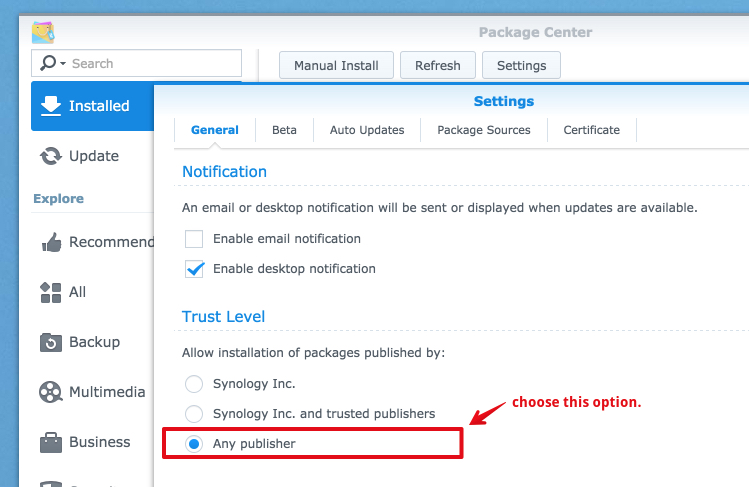
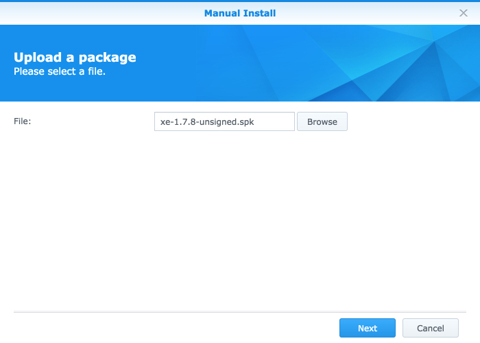
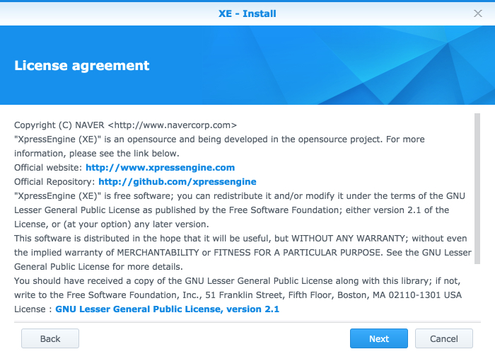
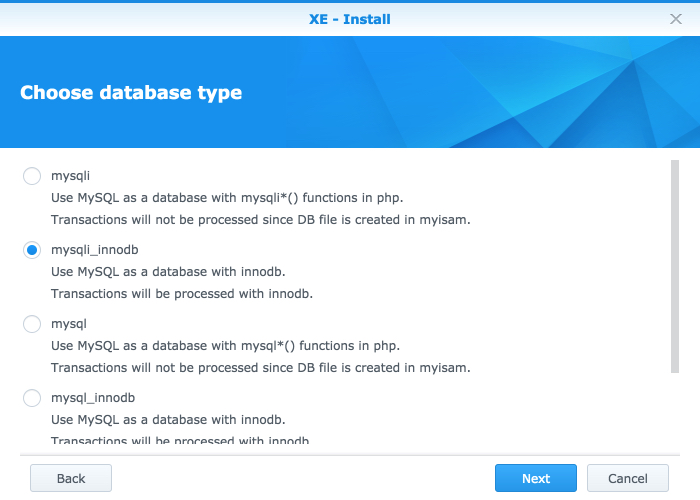
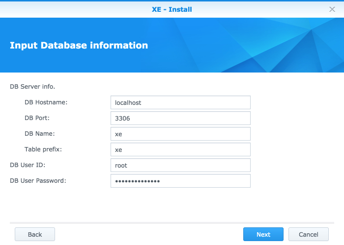
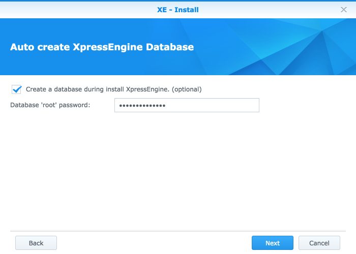
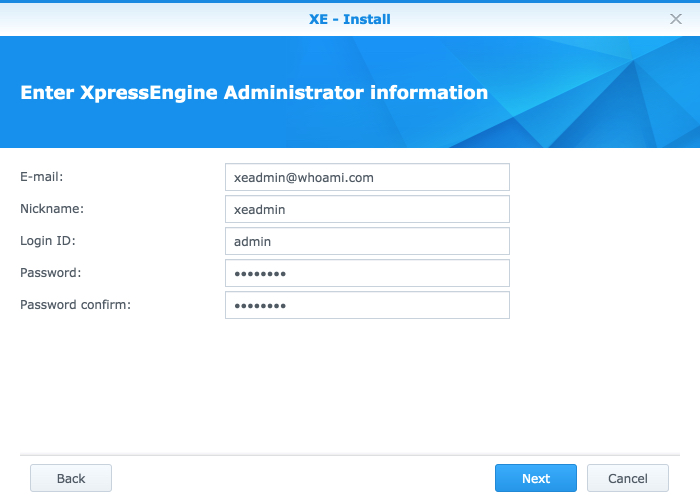
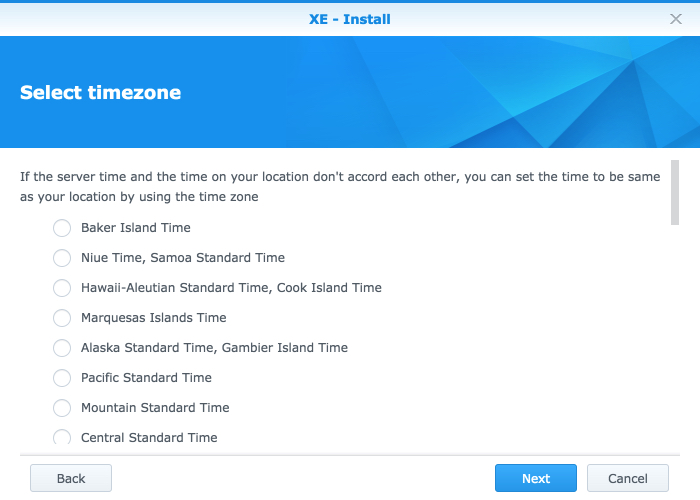
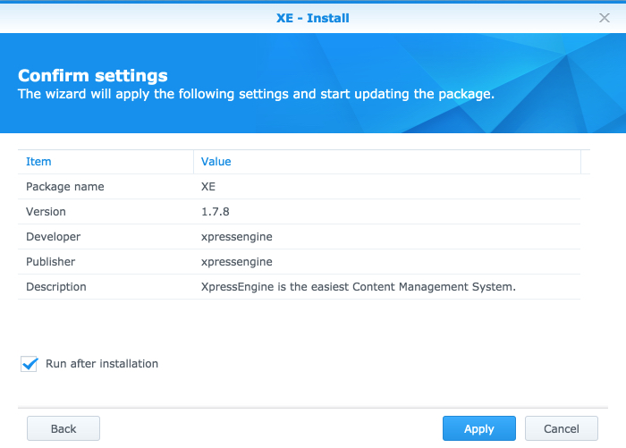
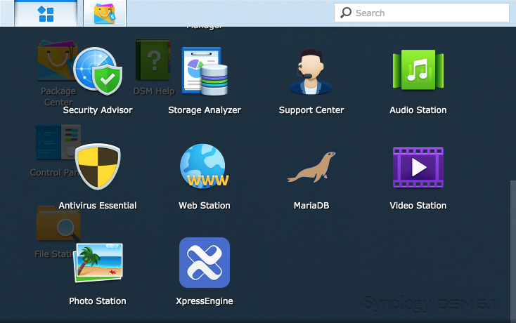
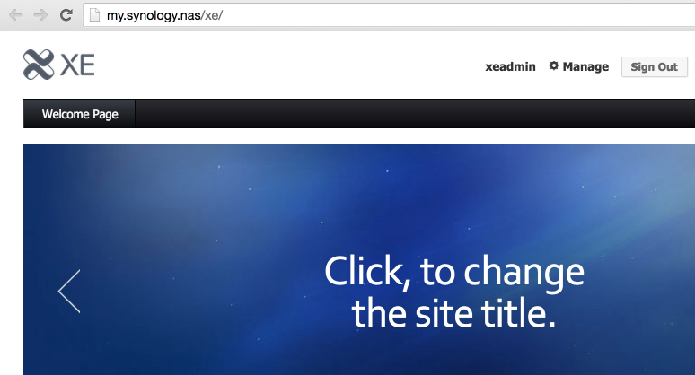
